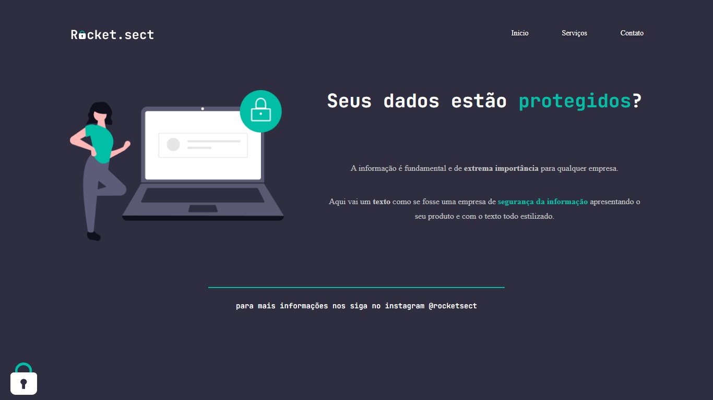

# Desafio Recriando Layout

Desafio do Stage02 que faz parte do Programa Explorer da Rocketseat  

Nesse desafio, você deverá recriar uma aplicação, a partir de um layout, para treinar o que aprendeu até agora no Stage 02.  

## Screenshots

[🔗 Clique aqui para acessar o Projeto](https://fabiovascao.github.io/Projeto-02-Recriando-Layout/)  
[🔗 Clique aqui para acessar o Figma](https://www.figma.com/file/AkSafCfR24JHozg5LfszuJ/Explorer-(Copy)?node-id=0%3A1)

## 🛠 Tecnologias

- HTML
- CSS
- Git e Github

## Autor

- [@FabioVascão](https://www.github.com/fabiovascao)